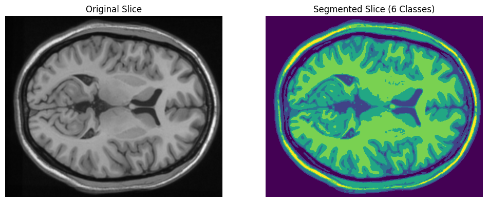
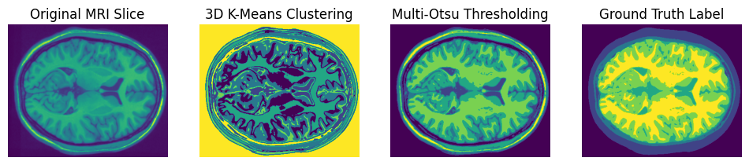
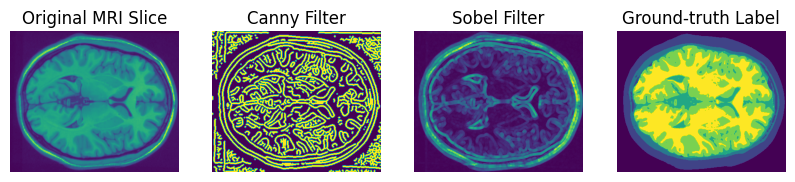
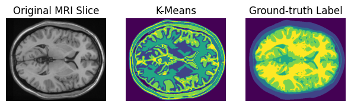

# Computer Vision Assignment: Image Segmentation Analysis

This repository contains the implementation and analysis of various image segmentation techniques applied to medical imaging data.

## Project Structure

```
CV_Assignment/
├── data/           # Raw data files
├── docs/           # Documentation and PDF files
├── images/         # Output images and results
```

## Overview

This project implements and compares different image segmentation techniques for medical image analysis, specifically focusing on brain MRI data. The implementation includes various methods such as:

- 2D and 3D Otsu Thresholding
- K-means Clustering
- Different Filtering Techniques

## Results

### 3D Otsu Thresholding

*Visualization of 3D Otsu thresholding results showing improved segmentation quality*

### Comparison of Different Techniques

*Comparison of different segmentation approaches*

### Filtering Techniques

*Analysis of various filtering techniques applied to the medical images*

### K-means Clustering

*Results of K-means clustering segmentation*

## Implementation Details

The main implementation is contained in the Jupyter notebooks, which include:
- Data loading and preprocessing
- Implementation of various segmentation algorithms
- Comparative analysis of different methods
- Visualization of results

## Data

The project uses brain MRI data (`Brain.mat`) for analysis and testing of the segmentation algorithms.

## Documentation

Detailed documentation and the original assignment can be found in the `docs/` directory.

## Key Findings

1. 3D Otsu thresholding showed improved results compared to traditional 2D approaches
2. K-means clustering provided effective segmentation with proper parameter tuning
3. Different filtering techniques showed varying levels of effectiveness in preprocessing

## Usage

To run the analysis:
1. Open the notebooks in the `notebooks/` directory
2. Ensure all dependencies are installed
3. Run the cells in sequence to reproduce the results

The final results and visualizations will be saved in the `images/` directory.
